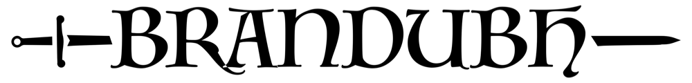

	

        

# Description
Brandubh, is the Irish variant of hnefatafl. It is the smallest, using a board of seven rows of seven squares, with just thirteen pieces.

# How to Play

## Teams

* Attackers: 8 red pieces.
* Defenders: 4 grey pieces, and a King.

## Starting Piece Positions

* The King is placed at the center of the 7X7 board surrounded on 4 sides (North, East, South, West) by his defenders.
* The 8 attacking pieces are placed in pairs alongside the King's defenders.
    
    
## Moves

* The attackers move first.
* The pieces can only move along the same Row or Column by as many empty cells as the player wishes but,
* Cannot, jump over other pieces.
* Pieces can only occupy empty cells.
* Only the King can occupy the center cell but cannot return to it once he has left it. He is also the only piece that can occupy the 4 corner cells.
* Pieces can pass over the center cell only if it is empty.

## Capture

* Pieces are captured when surrounded either above and below OR to their left and right by enemy pieces. The corner and the center cells function as enemy pieces. 
* The king is unarmed and cannot aid in capture. 
* To capture the King still at the center cell he must be surrounded N, E, S and W by attackers. At a cell next to the center cell or at a boarder cell the King must be surrounded by attackers on the remaining 3 sides.
* More than 2 pieces can be captured simultaneously if surrounded (above and below or left and right) on the same row or column by enemy pieces.

## The Winner

* Defenders: If the King reaches one of the 4 corner cells.
* Attackers: If they capture the King.

## Tie Conditions

* Inability to make a legal move. All pieces are blocked.
* Repetitive sequence of moves that do not lead to the capture of an enemy piece.
*  Player agreement.

## Opening Moves

> YouTube links

1. [Part 1](https://youtu.be/vBxOrOD2eD8)
1. [Part 2](https://youtu.be/Lv6rFWB8He4)
1. [Part 3](https://youtu.be/bU025qZ0Yxo)

# License
This project is licensed under the MIT License - see the [LICENSE](https://github.com/georgelivas/brandubh/blob/master/Licence) file for details.

# You may also like

* Breakout – The all time classic arcade game. [Show Me](http://georgelivas.site/breakout/)
* Folders for Mac – A collection of folder icons for Mac. [Show Me](https://github.com/georgelivas/Folders-for-Mac)

